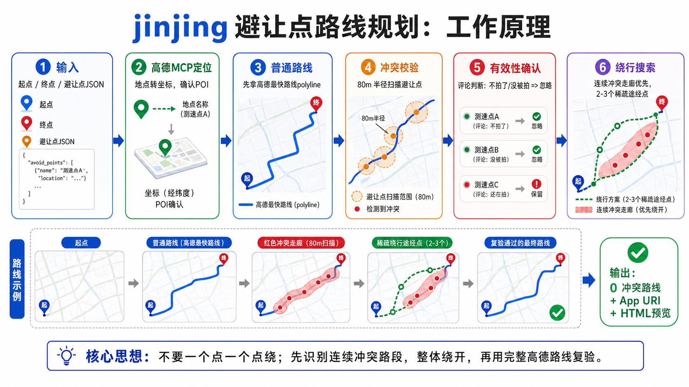

# jinjing-skill

高德/Amap 驾车路线规划 skill：在规划路线时避开进京证/限行相关坐标点，并输出可直接打开的高德 App URI 和静态路线图片。



## 免责声明

本项目仅用于学习、研究和技术交流，展示如何基于地图路线 polyline 做坐标避让校验与路径搜索。

- 本项目不提供法律、交通合规或出行安全建议。
- 本项目不鼓励、不协助规避交通执法、限行规定或其他法律法规要求。
- 点位数据、评论有效性判断、高德路线结果和实时路况都可能不准确或过期。
- 任何实际出行都应以当地法律法规、交管部门要求、道路标志标线和高德/车机实时导航为准。
- 使用者需要自行承担使用本项目产生的风险和责任。

## 能做什么

- 用高德 WebService 获取真实驾车路线 polyline。
- 用 `jinjing365_points.json` 校验路线是否经过避让点附近。
- 对命中的点位拉取/复用评论有效性判断，忽略明确失效的点。
- 遇到连续命中点位的路段时，优先整体绕开冲突走廊，而不是一个点一个点绕。
- 输出 iOS / Android 高德 App URI。
- 用 `--image` 输出静态 SVG 路线图片，展示路线、途经点、避让点、无效点和剩余冲突。

## 安装

```bash
git clone https://github.com/wz20/jinjing-skill.git ~/.codex/skills/jinjing
```

或复制到任意 Codex skill 目录，保持 `SKILL.md` 在 skill 根目录。

## 使用前准备

设置高德 WebService API key：

```bash
export AMAP_KEY="your-amap-key"
```

不要把 key 写进仓库。

## 规划路线

```bash
AMAP_KEY="$AMAP_KEY" python3 scripts/plan_amap_route.py \
  --origin "START_LON,START_LAT" \
  --destination "DEST_LON,DEST_LAT" \
  --avoid-json jinjing365_points.json \
  --max-rounds 1 \
  --beam-width 2 \
  --candidate-limit 4 \
  --strategy 0 \
  --image route-preview.svg
```

地名也可以作为输入，但需要高德能解析：

```bash
AMAP_KEY="$AMAP_KEY" python3 scripts/plan_amap_route.py \
  --origin "起点POI名称" \
  --destination "终点POI名称" \
  --city 北京 \
  --image route-preview.svg
```

## 手动验证途经点

```bash
AMAP_KEY="$AMAP_KEY" python3 scripts/plan_amap_route.py \
  --origin "START_LON,START_LAT" \
  --destination "DEST_LON,DEST_LAT" \
  --segments "MID1_LON,MID1_LAT;MID2_LON,MID2_LAT" \
  --avoid-json jinjing365_points.json \
  --image route-preview.svg
```

## 刷新点位

```bash
python3 scripts/update_jinjing_points.py
```

只刷新指定点位评论有效性：

```bash
python3 scripts/update_jinjing_points.py --ids 1284,962
```

## 算法思想

1. 先让高德返回普通路线，而不是一开始就绕路。
2. 对高德返回的完整 polyline 做 80m 半径避让点扫描。
3. 命中点位后，先用评论判断点位是否仍有效。
4. 如果冲突点连续分布在一段路上，把这段路当作冲突走廊。
5. 在冲突走廊侧向生成 2-3 个稀疏途经点，让高德整体绕开。
6. 对新路线再次完整校验，只接受 0 冲突路线。

核心原则：不要一个点一个点绕；先识别连续冲突路段，整体绕开，再用完整高德路线复验。

## 输出字段

常用字段：

- `ios_app_uri`: iPhone 高德 App URI
- `android_app_uri`: Android 高德 App URI
- `waypoints`: 使用的途经点
- `verified`: 自动路线是否 0 冲突
- `full_waypoint_route_verified`: 手动分段路线的完整 waypoint route 是否 0 冲突
- `remaining_conflicts`: 剩余冲突点
- `image`: 静态 SVG 路线图片路径

## 测试

```bash
python3 scripts/plan_amap_route.py --self-test
python3 scripts/update_jinjing_points.py --self-test
python3 -m py_compile scripts/plan_amap_route.py scripts/update_jinjing_points.py
```

## 注意

- 高德 WebService 驾车规划最多支持 16 个途经点。
- 高德 Web `https://uri.amap.com/navigation` 只适合分享普通链接，多途经点请使用输出的 App URI。
- `--html` 仍保留给本地调试，但正常输出请使用 `--image`。
- 路线是否最优受高德黑盒路线、实时路况、点位评论质量影响；本 skill 追求的是可验证的近似最优。

## License

MIT
